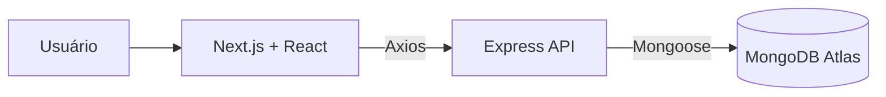

# Vértice

> CRM full-stack para organizar leads e oportunidades em um pipeline de vendas.

O Vértice centraliza o cadastro de contatos comerciais, acompanha o estágio de cada oportunidade e oferece métricas para apoiar decisões de venda.

## Status

🚧 Em desenvolvimento.

## Funcionalidades atuais

- Cadastro de leads com validação de formulário.
- Listagem de leads persistidos no MongoDB Atlas.
- Atualização do status comercial: Novo, Em contato, Proposta, Ganho e Perdido.
- Exclusão de leads.
- Busca por nome, empresa, e-mail ou telefone.
- Filtro por status.
- Métricas de leads cadastrados, propostas e valor em negociação.
- Estados de carregamento, erro e lista vazia.

## Próximas entregas

- Pipeline visual de oportunidades.
- Dados fictícios para demonstração.
- Capturas reais da aplicação e GIF do fluxo principal.
- Deploy público.
- Autenticação e controle de acesso.

## Tecnologias

### Frontend

- Next.js
- React
- TypeScript
- Tailwind CSS
- TanStack Query
- Axios
- React Hook Form
- Zod
- Lucide React

### Backend

- Node.js
- Express
- TypeScript
- MongoDB Atlas
- Mongoose
- Zod

## Arquitetura



## Estrutura do projeto

```text
vertice-crm/
├── api/                 # API Express e persistência MongoDB
│   ├── src/
│   │   ├── config/
│   │   ├── models/
│   │   ├── routes/
│   │   └── server.ts
│   └── .env.example
├── web/                 # Aplicação Next.js
│   └── src/
│       ├── app/
│       ├── components/
│       ├── lib/
│       └── types/
└── README.md
```

## Como executar localmente

### Pré-requisitos

- Node.js 22 ou superior.
- Uma conta MongoDB Atlas com um banco configurado.

### API

Em um terminal:

```bash
cd api
npm install
cp .env.example .env
npm run dev
```

No arquivo `api/.env`, defina a sua URI do MongoDB Atlas:

```env
PORT=3333
MONGODB_URI=sua_uri_do_mongodb
```

A API ficará disponível em `http://localhost:3333`.

### Frontend

Em outro terminal:

```bash
cd web
npm install
cp .env.example .env.local
npm run dev
```

O frontend ficará disponível em `http://localhost:3000`.

## Rotas da API

| Método | Rota | Descrição |
|---|---|---|
| `GET` | `/health` | Verifica a disponibilidade da API |
| `GET` | `/api/leads` | Lista os leads |
| `POST` | `/api/leads` | Cria um lead |
| `PATCH` | `/api/leads/:id` | Atualiza um lead |
| `DELETE` | `/api/leads/:id` | Exclui um lead |

## Demonstração

As capturas reais e o GIF do fluxo principal serão adicionados após a conclusão do pipeline visual.

## Autor

Desenvolvido por [Raphael Alves Brito](https://github.com/Britou).
